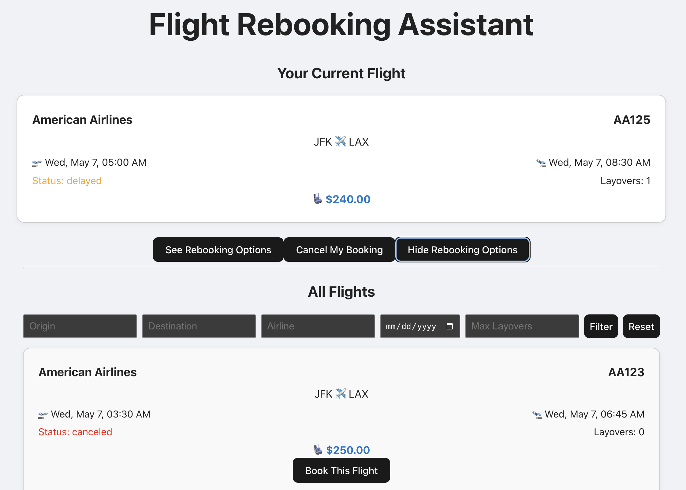

# ✈️ Flight Rebooking Assistant

A full-stack web app where users can view, book, rebook, and cancel flights. Built with React, Express, and PostgreSQL.

**Live App**: [https://flight-rebooker.vercel.app](https://flight-rebooker.vercel.app)

---



---

## Features

- View all available flights
- Each user gets a unique ID via `localStorage` (no login required)
- Book your first flight directly from the list
- If your flight is delayed or canceled, view rebooking options
- Cancel your current flight at any time
- Your flight status auto-updates in real time

---

## Tech Stack

| Frontend      | Backend           | Database      | Hosting           |
|---------------|------------------|----------------|--------------------|
| React (Vite)  | Node.js + Express | PostgreSQL     | Vercel + Railway   |

---

## Local Development Setup

### Prerequisites

- Node.js (v18+)
- PostgreSQL (or Railway database)

### 1. Clone the repo

```bash
git clone https://github.com/yourusername/flight-rebooker.git
cd flight-rebooker
```

### 2. Set up environment variables

In `/server/.env`:

```env
DATABASE_URL=your_postgres_connection_url
```

In `/client/.env.development`:

```env
VITE_API_URL=http://localhost:8000
```

### 3. Run the backend

```bash
cd server
npm install
node index.js
```

### 4. Run the frontend

```bash
cd ../client
npm install
npm run dev
```

---

## 🧠 Learning Goals

This project was created to:
- Learn full-stack development with PostgreSQL
- Practice RESTful API design
- Gain experience deploying apps to production
- Build a polished, resume-ready software project

---

## Project Scope & Limitations

This project represents a **functional MVP+** version of a flight rebooking system.  
It currently uses **simulated flight data stored in PostgreSQL**, with no real-time or third-party flight integration.

---

## Future Improvements

- **Connect to a real flights API**  
  This would enable real-time flight status, cancellations, and route availability, thus making the app usable by real users.

- **Implement user authentication**  
  While users are currently tracked anonymously via `localStorage`, future versions could support full account login, persistent sessions, and profile management.

---

## License

This project is licensed under the **[MIT License](LICENSE)**.  
You are free to use, modify, and distribute this code. See the `LICENSE` file for details.

---

## 👋 Author

Built by **Collin Graff**  
Computer Science Student @ University of Minnesota  
Expected Graduation: **2026**
